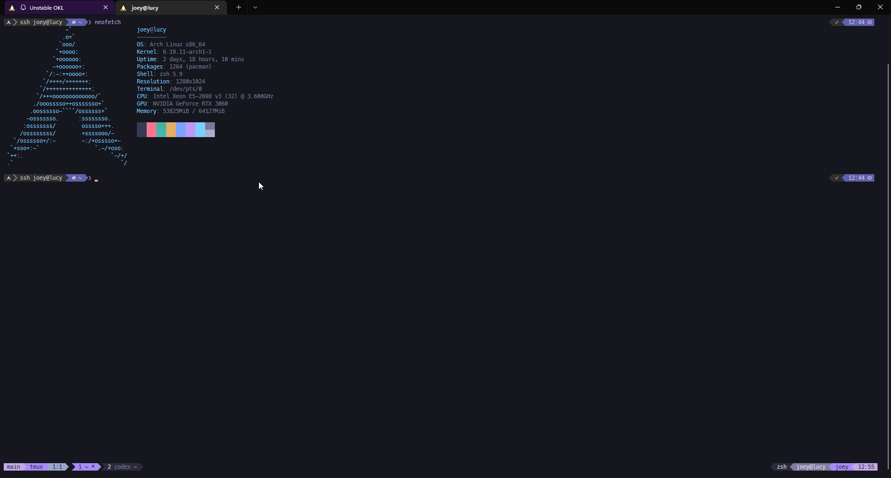

# obbyconfigs

Obby terminal config installer for Linux and macOS. It installs missing packages and applies the same tmux + zsh setup used on this machine: Manjaro/Dracula-style Powerlevel10k prompt, tmux powerline status, autosuggestions, syntax highlighting, history substring search, fzf hotkeys, zoxide, icon-aware `ls`, nano colors, and a Tokyo Night Windows Terminal scheme.

The repo is also a proper `uv` Python package with a CLI named `obbyinstaller`.

Docs: https://obnoxiousmods.github.io/obbyconfigs/
Wiki: https://github.com/obnoxiousmods/obbyconfigs/wiki
Homebrew tap: https://github.com/obnoxiousmods/homebrew-obbyconfigs



## Quick install

Linux/macOS one-liner:

```bash
bash -c "$(curl -fsSL https://raw.githubusercontent.com/obnoxiousmods/obbyconfigs/main/install.sh)" -- --yes --dotfile-mode overwrite --package-mode optional --nano-mode auto
```

Windows PowerShell helper for Meslo fonts and Tokyo Night:

```powershell
iwr https://raw.githubusercontent.com/obnoxiousmods/obbyconfigs/main/install.ps1 -OutFile install.ps1
powershell -ExecutionPolicy Bypass -File .\install.ps1 -InstallFonts -PrintScheme
```

Windows WSL handoff:

```powershell
powershell -ExecutionPolicy Bypass -File .\install.ps1 -WslDistro Ubuntu -- --yes --dotfile-mode overwrite --package-mode optional --nano-mode auto
```

Run from a checkout:

```bash
git clone https://github.com/obnoxiousmods/obbyconfigs.git
cd obbyconfigs
python3 obbyinstaller.py --list-plan
python3 obbyinstaller.py --dry-run --yes --dotfile-mode overwrite --package-mode optional --skip-shell-change
python3 obbyinstaller.py --yes --dotfile-mode overwrite --package-mode optional
```

Run through uv:

```bash
git clone https://github.com/obnoxiousmods/obbyconfigs.git
cd obbyconfigs
uv sync --all-groups
uv run obbyinstaller --list-plan
uv run obbyinstaller --yes --dotfile-mode overwrite --package-mode optional
```

Install the CLI into your uv tool environment:

```bash
uv tool install .
obbyinstaller --help
```

## What It Installs

Required packages:

- Alpine: `bat`, `curl`, `eza`, `fd`, `fzf`, `git`, `nano`, `neovim`, `python3`, `ripgrep`, `tmux`, `unzip`, `wget`, `zoxide`, `zsh`
- Arch: `base-devel`, `bat`, `curl`, `eza`, `fd`, `fzf`, `git`, `neovim`, `python`, `ripgrep`, `tmux`, `unzip`, `wget`, `zoxide`, `zsh`
- Ubuntu/Debian: `bat`, `build-essential`, `curl`, `fd-find`, `fzf`, `git`, `neovim`, `python3`, `ripgrep`, `tmux`, `unzip`, `wget`, `zoxide`, `zsh`
- Fedora/RHEL/Rocky/CentOS: `bat`, `curl`, `eza`, `fd-find`, `fzf`, `git`, `nano`, `neovim`, `python3`, `ripgrep`, `tmux`, `unzip`, `wget`, `zoxide`, `zsh`
- openSUSE/SUSE: `bat`, `curl`, `eza`, `fd`, `fzf`, `git`, `nano`, `neovim`, `python3`, `ripgrep`, `tmux`, `unzip`, `wget`, `zoxide`, `zsh`
- macOS/Homebrew: `bat`, `curl`, `eza`, `fd`, `fzf`, `git`, `nano`, `neovim`, `python`, `ripgrep`, `tmux`, `wget`, `zoxide`, `zsh`

Optional packages with `--package-mode optional` or `--package-mode all`:

- Alpine: `github-cli`, `less`, `nodejs`, `npm`, `py3-pip`, `pipx`, `tree`, `uv`
- Arch: `github-cli`, `less`, `nano`, `nodejs`, `npm`, `python-pip`, `python-pipx`, `tree`, `uv`
- Ubuntu/Debian: `gh`, `less`, `nano`, `nodejs`, `npm`, `pipx`, `python3-pip`, `python3-venv`, `tree`
- Fedora/RHEL/Rocky/CentOS: `gh`, `less`, `nodejs`, `npm`, `pipx`, `python3-pip`, `python3-virtualenv`, `tree`, `uv`
- openSUSE/SUSE: `gh`, `less`, `nodejs`, `npm`, `python3-pip`, `python3-virtualenv`, `tree`
- macOS/Homebrew: `gh`, `less`, `node`, `pipx`, `tree`, `uv`

Package groups with `--package-mode all --package-groups dev,python,node,containers,network,fonts` add broader developer, Python, Node, container, networking, and font tools when the current package manager has them. The installer checks installed packages and skips unavailable package names instead of failing the full run.

Supported package managers:

- `pacman` on Arch-style systems.
- `apt-get` on Ubuntu/Debian-style systems.
- `dnf` on Fedora/RHEL/Rocky/CentOS-style systems.
- `zypper` on openSUSE/SUSE-style systems.
- `apk` on Alpine.
- `brew` on macOS Intel and Apple Silicon.

Release/package-manager routes:

- GitHub Releases publish wheels, source archives, `obbyinstaller.pyz`, `install.sh`, `install.ps1`, and nFPM-built `.deb`, `.rpm`, `.apk`, and Arch-style package artifacts.
- Release zip bundles are built for Linux, macOS, and Windows helpers: `obbyconfigs-linux-any.zip`, `obbyconfigs-macos-any.zip`, and `obbyconfigs-windows-any.zip`.
- GHCR publishes a multi-arch container image for `linux/amd64` and `linux/arm64`: `ghcr.io/obnoxiousmods/obbyconfigs`.
- PyPI publishing is wired through trusted publishing in `.github/workflows/pypi.yml` when `ENABLE_PYPI_PUBLISH=true` is configured after PyPI trust setup.
- AUR publishing is wired through `.github/workflows/aur.yml` and `packaging/arch/PKGBUILD` when `AUR_SSH_PRIVATE_KEY` is configured.
- Homebrew tap publishing is wired through `.github/workflows/homebrew.yml` and `packaging/homebrew/obbyconfigs.rb` when `HOMEBREW_TAP_REPO` and `HOMEBREW_TAP_TOKEN` are configured.
- Debian, RPM, Arch, and nFPM package recipes live in `packaging/`.

Install through package ecosystems after the relevant registry publisher is configured:

```bash
uv tool install obbyconfigs
pipx install obbyconfigs
yay -S obbyconfigs
brew tap obnoxiousmods/obbyconfigs
brew install obbyconfigs
```

Registry publisher setup:

- PyPI: create the `obbyconfigs` project/trusted publisher for `obnoxiousmods/obbyconfigs`, workflow `PyPI`, environment `pypi`, then set repo variable `ENABLE_PYPI_PUBLISH=true`.
- AUR: add an AUR SSH private key as repo secret `AUR_SSH_PRIVATE_KEY`; the workflow publishes `packaging/arch/PKGBUILD` and generated `.SRCINFO`.
- Homebrew: the tap repo is `obnoxiousmods/homebrew-obbyconfigs`; repo variable `HOMEBREW_TAP_REPO` is set to that repo, and automatic tap pushes need a repo secret `HOMEBREW_TAP_TOKEN` with push access to the tap.
- GitHub Releases/GHCR: use the built-in `GITHUB_TOKEN`; no extra secret is required for the current repo.

Shell features:

- Machine-matching Dracula zsh prompt and tmux status templates.
- Auto-attach to the newest tmux session when an interactive shell starts outside tmux, or create `${OBBY_TMUX_SESSION:-main}` when no session exists. Set `NO_AUTO_TMUX=1` to disable it for that shell.
- Oh My Zsh
- Powerlevel10k
- `zsh-autosuggestions`
- `zsh-syntax-highlighting`
- `zsh-completions`
- `zsh-history-substring-search`
- fzf key bindings and completions when available
- zoxide initialization when available
- uv aliases: `uvr`, `uvs`, `uvx`
- pyenv, nvm, and bun startup when installed
- `eza`/`exa`/`lsd` icon aliases for `ls`, `ll`, `la`, and `tree`, with a themed `LS_COLORS` fallback for standard `ls`
- Optional nano Dracula UI colors and syntax highlighting setup with built-in nano syntax includes.
- Expanded tmux hotkeys with multiple Linux/Windows-terminal-friendly bindings. See `docs/TMUX_HOTKEYS.md`.

PATH support:

- `$HOME/.local/bin`
- `$HOME/bin`
- `$HOME/.cargo/bin`
- `$HOME/go/bin`
- `$HOME/.npm-global/bin`
- `$HOME/.yarn/bin`
- `$HOME/.bun/bin`
- `$HOME/.deno/bin`
- `$HOME/.pyenv/bin`
- `$HOME/.rye/shims`
- `$HOME/.local/share/uv/tools`
- `$HOME/.local/share/pnpm`
- `$HOME/.config/yarn/global/node_modules/.bin`
- `$PWD/node_modules/.bin`
- `$PWD/.venv/bin`
- `$PWD/venv/bin`

## Scope Modes

User scope is the default:

```bash
obbyinstaller --scope user --yes --dotfile-mode overwrite
```

User scope writes:

- `~/.tmux.conf`
- `~/.zshrc`
- `~/.p10k.zsh`
- `~/.oh-my-zsh`
- `~/.oh-my-zsh/custom`
- `~/.tmux/bin/pane-title`
- `~/.tmux/bin/pane-context`
- `~/.nanorc` when `--nano-mode auto` or `--nano-mode force` is used
- `~/.nano/obby-dracula.nanorc` when `--nano-mode auto` or `--nano-mode force` is used

System/all-users scope:

```bash
sudo obbyinstaller --scope system --yes --dotfile-mode overwrite --package-mode optional --system-zsh-hook
```

System scope writes:

- `/etc/tmux.conf`
- `/etc/obbyconfigs/zshrc`
- `/etc/obbyconfigs/p10k.zsh`
- `/usr/local/share/obbyconfigs/oh-my-zsh`
- `/usr/local/share/obbyconfigs/oh-my-zsh/custom`
- `/usr/local/share/obbyconfigs/tmux/bin/pane-title`
- `/usr/local/share/obbyconfigs/tmux/bin/pane-context`
- `/etc/nanorc` when `--nano-mode auto` or `--nano-mode force` is used
- `/usr/local/share/obbyconfigs/nano/obby-dracula.nanorc` when `--nano-mode auto` or `--nano-mode force` is used

`--system-zsh-hook` makes `/etc/zsh/zshrc` source `/etc/obbyconfigs/zshrc`. Without that flag, the system zsh config is written but not hooked into every user shell.

Use `--target-user USERNAME` when forcing a shell change for another user:

```bash
sudo obbyinstaller --scope system --target-user obby --shell-mode force
```

## Mode Flags

Preview first:

```bash
obbyinstaller --list-plan
obbyinstaller --dry-run --yes --dotfile-mode overwrite --package-mode optional
```

Package modes:

- `--package-mode required`: install only required missing packages.
- `--package-mode optional`: install required packages plus optional developer tools.
- `--package-mode all`: same as optional, reserved for future expansion.
- `--package-mode none`: skip package installs.
- `--package-mode force`: pass all packages to the package manager even if they look installed.

Zsh asset modes:

- `--zsh-mode auto`: clone Oh My Zsh only when missing.
- `--zsh-mode skip`: do not install Oh My Zsh.
- `--zsh-mode force`: move the existing Oh My Zsh path to a backup name and clone again.

Plugin modes:

- `--plugin-mode auto`: clone missing plugins only.
- `--plugin-mode skip`: do not install plugins.
- `--plugin-mode force`: move existing plugin paths to backup names and clone again.

Dotfile modes:

- `--dotfile-mode safe`: do not overwrite existing config files.
- `--dotfile-mode overwrite`: back up existing config files and replace them.
- `--dotfile-mode force`: same write behavior as overwrite, intended for full forced runs.
- `--no-backup`: replace without saving `.backup-YYYYMMDD-HHMMSS` files.

Shell modes:

- `--shell-mode ask`: ask before running `chsh`.
- `--shell-mode skip`: do not change the default shell.
- `--shell-mode force`: run `chsh` without asking.

Nano modes:

- `--nano-mode skip`: do not write nano config. This is the default.
- `--nano-mode auto`: write nano config using the selected dotfile mode.
- `--nano-mode force`: replace nano config regardless of the selected dotfile mode.
- `--only-nano`: write only nano config and syntax files.

Global force mode:

```bash
obbyinstaller --force --yes
```

`--force` sets package, zsh, plugin, dotfile, and shell modes to force.

Path overrides:

- `--home PATH`
- `--tmux-conf PATH`
- `--zshrc PATH`
- `--p10k PATH`
- `--oh-my-zsh PATH`
- `--zsh-custom PATH`
- `--tmux-bin PATH`
- `--nanorc PATH`
- `--nano-syntax-dir PATH`

Distro override:

```bash
obbyinstaller --assume-distro alpine --list-plan
obbyinstaller --assume-distro arch --list-plan
obbyinstaller --assume-distro ubuntu --list-plan
obbyinstaller --assume-distro debian --list-plan
obbyinstaller --assume-distro fedora --list-plan
obbyinstaller --assume-distro opensuse --list-plan
obbyinstaller --assume-distro macos --list-plan
```

Legacy flags still work:

- `--overwrite`
- `--skip-packages`
- `--skip-shell-change`
- `--optional-packages`

## Windows Terminal: Meslo, Powerline, OS Icons, Tokyo Night

Install Meslo with Nerd Font symbols. Powerlevel10k expects a MesloLGS Nerd Font so Powerline arrows and OS icons render correctly.

1. Download the four MesloLGS NF font files from the Powerlevel10k font page:
   - `MesloLGS NF Regular.ttf`
   - `MesloLGS NF Bold.ttf`
   - `MesloLGS NF Italic.ttf`
   - `MesloLGS NF Bold Italic.ttf`
2. Windows 11 or Windows 10: select the `.ttf` files, right click, then choose `Install for all users`.
3. Open Windows Terminal.
4. Go to `Settings` > your Linux profile, such as Ubuntu, Debian, or Arch.
5. Set `Font face` to `MesloLGS NF`.
6. Open `Settings` > `Open JSON file`.
7. Add this object to the top-level `schemes` array:

```json
{
  "background": "#1A1B26",
  "black": "#15161E",
  "blue": "#7AA2F7",
  "brightBlack": "#414868",
  "brightBlue": "#7AA2F7",
  "brightCyan": "#7DCFFF",
  "brightGreen": "#9ECE6A",
  "brightPurple": "#BB9AF7",
  "brightRed": "#F7768E",
  "brightWhite": "#C0CAF5",
  "brightYellow": "#E0AF68",
  "cursorColor": "#C0CAF5",
  "cyan": "#7DCFFF",
  "foreground": "#C0CAF5",
  "green": "#9ECE6A",
  "name": "Tokyo Night",
  "purple": "#BB9AF7",
  "red": "#F7768E",
  "selectionBackground": "#33467C",
  "white": "#A9B1D6",
  "yellow": "#E0AF68"
}
```

8. In the same profile JSON, set:

```json
"font": {
  "face": "MesloLGS NF"
},
"colorScheme": "Tokyo Night"
```

9. Save the settings file and restart Windows Terminal.

Print the scheme from the installer:

```bash
obbyinstaller --print-windows-terminal-scheme
```

## Manual Install Guide

Arch Linux:

```bash
sudo pacman -Syu --needed base-devel bat curl eza fd fzf git neovim python ripgrep tmux unzip wget zoxide zsh
sudo pacman -S --needed github-cli less nano nodejs npm python-pip python-pipx tree uv
```

Ubuntu/Debian:

```bash
sudo apt-get update
sudo apt-get install -y bat build-essential curl fd-find fzf git neovim python3 ripgrep tmux unzip wget zoxide zsh
sudo apt-get install -y gh less nano nodejs npm pipx python3-pip python3-venv tree
```

Fedora/RHEL/Rocky/CentOS:

```bash
sudo dnf install -y bat curl eza fd-find fzf git nano neovim python3 ripgrep tmux unzip wget zoxide zsh
sudo dnf install -y gh less nodejs npm pipx python3-pip python3-virtualenv tree uv
```

openSUSE/SUSE:

```bash
sudo zypper --non-interactive install bat curl eza fd fzf git nano neovim python3 ripgrep tmux unzip wget zoxide zsh
sudo zypper --non-interactive install gh less nodejs npm python3-pip python3-virtualenv tree
```

Alpine:

```bash
sudo apk update
sudo apk add bat curl eza fd fzf git nano neovim python3 ripgrep tmux unzip wget zoxide zsh
sudo apk add github-cli less nodejs npm py3-pip pipx tree uv
```

macOS:

```bash
brew install bat curl eza fd fzf git nano neovim python ripgrep tmux wget zoxide zsh
brew install gh less node pipx tree uv
```

Install zsh assets:

```bash
git clone --depth=1 https://github.com/ohmyzsh/ohmyzsh.git "$HOME/.oh-my-zsh"
ZSH_CUSTOM="${ZSH_CUSTOM:-$HOME/.oh-my-zsh/custom}"
git clone --depth=1 https://github.com/romkatv/powerlevel10k.git "$ZSH_CUSTOM/themes/powerlevel10k"
git clone --depth=1 https://github.com/zsh-users/zsh-autosuggestions.git "$ZSH_CUSTOM/plugins/zsh-autosuggestions"
git clone --depth=1 https://github.com/zsh-users/zsh-syntax-highlighting.git "$ZSH_CUSTOM/plugins/zsh-syntax-highlighting"
git clone --depth=1 https://github.com/zsh-users/zsh-completions.git "$ZSH_CUSTOM/plugins/zsh-completions"
git clone --depth=1 https://github.com/zsh-users/zsh-history-substring-search.git "$ZSH_CUSTOM/plugins/zsh-history-substring-search"
```

Write only dotfiles from the installer:

```bash
obbyinstaller --only-dotfiles --yes --dotfile-mode overwrite
```

Write only nano config:

```bash
obbyinstaller --only-nano --yes --dotfile-mode overwrite
```

Change your default shell:

```bash
chsh -s "$(command -v zsh)"
```

Restart the terminal, then configure the prompt:

```bash
p10k configure
```

Reload tmux after editing:

```bash
tmux source-file ~/.tmux.conf
```

## Project Development

Use uv:

```bash
uv sync --all-groups
uv run ruff check .
uv run python -m compileall obbyinstaller.py src
uv run obbyinstaller --list-plan --skip-packages --skip-shell-change
```

GitHub project files included:

- CI workflow with uv and Python 3.11, 3.12, and 3.13
- CodeQL scanning
- Dependabot for GitHub Actions and uv
- Release workflow for GitHub Release assets and nFPM packages
- PyPI, AUR, Homebrew tap, GHCR, and Pages workflows
- Issue forms
- Pull request template
- CODEOWNERS
- Copilot instructions
- Security policy
- Contribution guide

## Safety

Run `--dry-run` and `--list-plan` first. The installer avoids reinstalling packages and does not overwrite existing dotfiles unless `--dotfile-mode overwrite`, `--dotfile-mode force`, or `--force` is present. Replaced dotfiles are saved next to the original path with a `.backup-YYYYMMDD-HHMMSS` suffix unless `--no-backup` is used.
